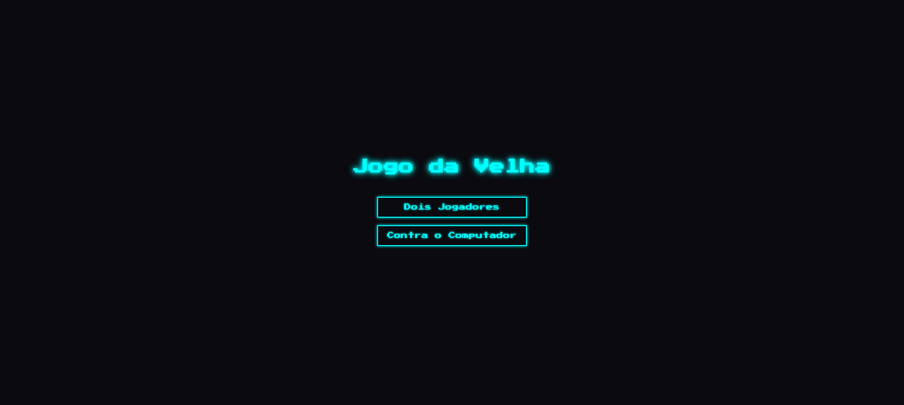
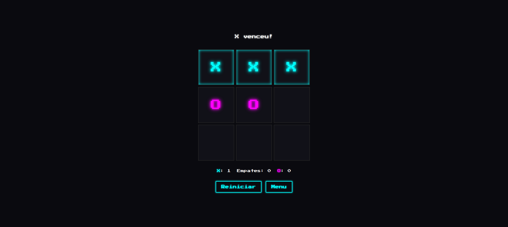

# Jogo da Velha 🎮 (retro/neon)

[](https://luhfilho.github.io/jogo-da-velha-kimi-demo/)
[](https://github.com/luhfilho/kimi-plugin-cross-platform)
[](#)
[](#)
[](LICENSE)

Jogo da velha (tic-tac-toe) em **JavaScript puro** — sem frameworks, sem build, sem
dependências (apenas uma fonte do Google Fonts). Modo **2 jogadores (PvP local)** e
**contra o computador (IA)**, com estilo retro/neon, placar, destaque da linha
vencedora e tabuleiro responsivo.

> ⚙️ **Prova de conceito gerada com o
> [kimi-plugin-cross-platform](https://github.com/luhfilho/kimi-plugin-cross-platform)
> v0.2.0.** Este repositório é a evidência funcional de que o pipeline
> *Claude planeja → Kimi implementa → Codex revisa → testes no Chrome* funcionou de
> ponta a ponta. Veja a seção [Como foi feito](#-como-foi-feito).

## 🔗 Demo ao vivo

**▶️ https://luhfilho.github.io/jogo-da-velha-kimi-demo/**

> Servido via GitHub Pages a partir da branch `main` (raiz do repositório).

## ✨ Funcionalidades

- **Menu inicial** para escolher entre *Dois Jogadores* (PvP) ou *Contra o Computador* (PvC).
- **IA** (modo PvC): joga em uma casa vazia aleatória, com um pequeno atraso para
  dar a sensação de "pensar"; o tabuleiro fica bloqueado durante o turno da máquina.
- **Estilo retro/neon**: fundo escuro, X em ciano e O em magenta com efeito *glow*,
  fonte arcade *Press Start 2P*.
- **Placar de sessão** (vitórias de X, O e empates).
- **Destaque da linha vencedora** com animação *pulse-glow*.
- **Reiniciar** (mantém o placar) e **Menu** (zera o placar).
- **Responsivo** (a grade escala com `vmin`).

## 🚀 Como rodar localmente

Como é HTML/CSS/JS puro, basta servir o diretório (ou abrir o `index.html`
diretamente — só a fonte precisa de internet):

```bash
python3 -m http.server 8000
# abra http://localhost:8000
```

## 📁 Estrutura

```
.
├── index.html      # estrutura: tela de menu + tela de jogo
├── styles.css      # tema retro/neon, grade 3x3, animações
├── script.js       # máquina de estados, lógica de vitória, IA, placar
└── evidencias/     # screenshots de evidência
```

A arquitetura segue o princípio de **estado único como fonte da verdade**: um objeto
`state` (board, jogador da vez, modo, placar) governa o jogo, e o DOM apenas reflete
esse estado. Os cliques usam **delegação de eventos** (um único listener na grade).

## 🧪 Como foi feito (o pipeline)

Este projeto foi construído de forma totalmente orquestrada, como demonstração do
`kimi-plugin-cross-platform` v0.2.0:

| Etapa | Ferramenta | O que fez |
|-------|-----------|-----------|
| 1. Planejamento | **Claude Code** (Opus) | Definiu requisitos, arquitetura e plano de implementação. |
| 2. Implementação | **Kimi** via `/kimi:code` | Escreveu `index.html`, `styles.css` e `script.js`. |
| 3. Code review | **Codex** (revisão adversarial) | Encontrou 5 problemas, incluindo 1 *race condition* crítica na IA. |
| 4. Correções | **Kimi** | Aplicou os fixes (token de geração + `clearTimeout`, etc.). |
| 5. Testes | **Chrome** (DevTools MCP) | 7 cenários funcionais — todos passaram, console limpo. |

### 🐞 Destaque do code review: bug crítico encontrado e corrigido

A revisão adversarial detectou uma **condição de corrida**: em PvC, o `setTimeout` da
IA disparava uma "jogada-fantasma" mesmo após o jogador clicar em *Reiniciar* antes
dos ~400ms. Foi corrigido com um **token de geração** (invalidando callbacks antigos)
somado a `clearTimeout`. O teste funcional confirma a correção.

## 📸 Evidências

| Menu inicial | Vitória (linha destacada) |
|--------------|---------------------------|
|  |  |

## 📊 Consumo de tokens

Quanto cada agente consumiu nesta sessão — detalhes e metodologia em
[`CONSUMO-DE-TOKENS.md`](CONSUMO-DE-TOKENS.md) (Claude e Codex exatos; Kimi estimado, +20%):

| Agente | Papel | Tokens |
|--------|-------|-------:|
| 🟦 Claude (Opus) | Planeja, orquestra, testa, publica | 27.030.848 processados¹ |
| 🟪 Codex | Revisão adversarial | 246.604 |
| 🟧 Kimi | Implementa + corrige | ~205.000 (estimado) |

¹ ~91% é *cache read* (reuso barato); o núcleo é input fresco (~107k) + output (~233k).

## 📄 Licença

MIT.
